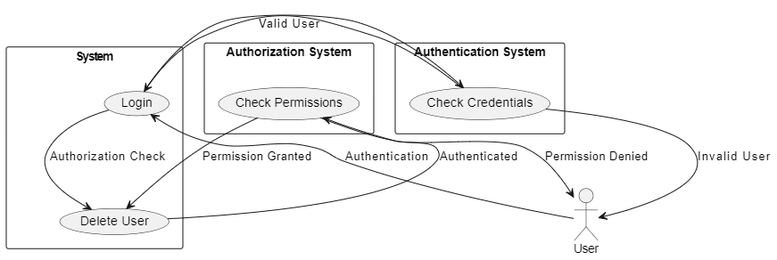

# userManagement.js Summary

### 1. **File Name:** `userManagement.js`

### 2. **Purpose:**
- This file integrates both backend and frontend logic for deleting a user by their username in a web application.

### 3. **Key Components:**

- **Backend:**
  - **Controller Function:** `delete_user_by_username(req, res)`
    - Handles the deletion of a user based on the provided username.
    - Includes error handling for missing or non-existent users.
  - **Route:** `POST /delete/user`
    - Uses middleware for authentication and authorization.
    - Calls the controller function to delete the user.

- **Frontend:**
  - **Event Listener:** 
    - Listens for form submission to delete a user.
    - Sends a POST request to the backend with the username to be deleted.
    - Provides user feedback via alerts based on the success or failure of the request.

### 4. **Integration:**
- Combines backend route handling and frontend interaction in one file for streamlined user management.

# Challenge Part 2: Authentication vs Authorization

### 1. **Requirement Evaluation:**
- **Requirement:** "This delete user functionality can be done after authentication."
  
- **Good or Bad Idea?**
  - **Good Idea:** Authentication ensures that the user is who they claim to be before performing any sensitive operations like deleting a user. This is crucial for securing user accounts and data.
  - **Potential Issue:** While authentication confirms identity, it does not check whether the user has the rights (authorization) to delete another user. This could lead to security vulnerabilities if not handled properly.

### 2. **Explanation:**
- **Authentication:** 
  - **Definition:** The process of verifying the identity of a user. 
  - **Purpose:** To ensure that the person or system interacting with the application is who they claim to be.
  - **Example:** Logging in with a username and password.

- **Authorization:**
  - **Definition:** The process of verifying what actions an authenticated user is allowed to perform.
  - **Purpose:** To determine whether a user has the permissions to execute a particular operation (e.g., deleting a user).
  - **Example:** Only allowing admins to delete users, while regular users can only manage their own profiles.

### 3. **Conclusion:**
- While authentication is necessary for user identification, authorization is equally important to ensure that only users with the proper permissions can perform actions like deleting other users. Both concepts must be implemented together to maintain the security and integrity of the application.

### 4. **Additional Resources:**
- Consider using diagrams to illustrate the flow between authentication and authorization.
- A video presentation can further elaborate on these concepts with real-world examples.

### 5. **Diagram:**
- Below is a visual representation of the authentication and authorization flow:

